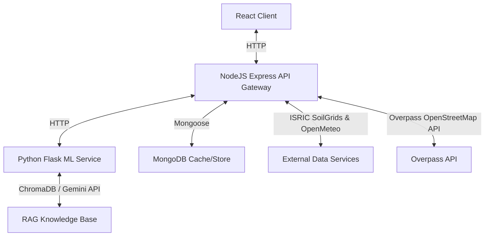

# HarvestIQ 🌾

HarvestIQ is a state-of-the-art decision-support system designed to empower farmers and agricultural stakeholders. By combining machine learning models, dynamic geospatial API analysis, and local soil/weather data, HarvestIQ provides actionable agronomic insights, price trends, and risk assessments.

---

## 🚀 Key Features

*   **📍 Precision Soil & Weather Profiling:** Instantly fetches soil properties (depth, pH, sand, clay, organic carbon) from **ISRIC SoilGrids** and real-time/forecasted weather from **Open-Meteo** based on farm coordinates.
*   **🌾 AI-Driven Crop Recommendations:** Suggests the top-yielding crops for your exact soil type, pH, temperature, precipitation, and elevation using a custom Gradient Boosting classifier.
*   **💧 Dynamic Borewell Risk Assessment:** Evaluates groundwater drilling success rates and estimated costs by analyzing soil retention, elevation, rainfall, and real-time distance to nearest rivers/waterbodies queried via the **OpenStreetMap Overpass API**.
*   **📈 Mandi Price Tracking & Yield Prediction:** Displays real-time market prices across Indian mandis and predicts crop-specific yields (in tons/acre) under varying environmental parameters.
*   **🤖 AI Farm Assistant (RAG Chat):** Integrated conversational agent built on **LangChain** and a **Chroma Vector DB** database, powered by **Google Gemini Pro**, to answer complex agricultural questions.
*   **⚡ High-Performance Cache Layer:** MongoDB caching layer with automated 24-hour Time-To-Live (TTL) indices for farm analyses and mandi prices to reduce API overhead and network latency.
*   **👥 Multi-User Isolation:** Sandbox environment dynamically separating bookmark histories and saved farms for individual users using secure localStorage client-side hashing.
*   **🌐 Multilingual Localization:** Native translation support in **English**, **Hindi (हिन्दी)**, and **Tamil (தமிழ்)**.

---

## ⚙️ System Architecture

HarvestIQ is built as a monorepo consisting of three main components:



### Tech Stack
*   **Frontend:** React, Vite, Leaflet Maps, Recharts, Material-UI, i18next.
*   **Backend:** Node.js, Express, Mongoose, Axios, CORS.
*   **Machine Learning & AI:** Flask, Scikit-Learn, Pandas, NumPy, LangChain, Google GenAI SDK, ChromaDB, python-dotenv.

---

## 🔧 Installation & Configuration

### Prerequisites
*   Node.js (v18+)
*   Python (3.9+)
*   MongoDB Instance (Local or Atlas)

### Setup Environment Files

#### 1. Backend Configuration
Create a `.env` file in the `backend/` directory based on the template:
```bash
cp backend/.env.example backend/.env
```
Configure your credentials:
```env
PORT=5000
MONGODB_URI=mongodb://localhost:27017/farmsense
ML_SERVICE_URL=http://127.0.0.1:5001
DATA_GOV_API_KEY=your_api_key_here
```

#### 2. ML Service Configuration
Create an `environment.env` file in the `ml/` directory:
```bash
cp ml/environment.env.example ml/environment.env
```
Provide your Google AI Studio API key:
```env
GEMINI_API_KEY=your_gemini_api_key_here
```

---

## 🏃 Running the Application

### 1. Python ML Service
```bash
cd ml
python -m venv venv
# On Windows:
.\venv\Scripts\activate
# On Linux/macOS:
source venv/bin/activate

pip install -r requirements.txt
python app.py
```
*The ML server runs on `http://127.0.0.1:5001`.*

### 2. Node.js Backend
```bash
cd backend
npm install
npm start
```
*The gateway server runs on `http://localhost:5000`.*

### 3. Frontend App
```bash
cd frontend
npm install
npm run dev
```
*Open `http://localhost:5173` in your browser.*
