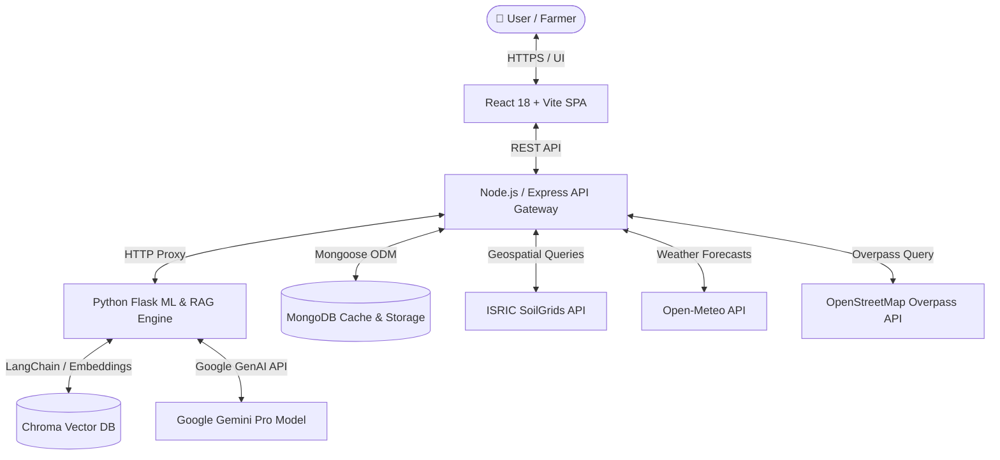

# 🌾 HarvestIQ — Enterprise Agricultural Decision-Support System

[](https://nodejs.org/)
[](https://www.python.org/)
[](https://react.dev/)
[](LICENSE)
[]()

> **HarvestIQ** is an AI-powered agronomic decision-support platform designed for farmers, agronomists, and agricultural planners. By integrating Gradient Boosting machine learning models, geospatial API pipelines (ISRIC SoilGrids, Open-Meteo, OpenStreetMap Overpass), and a Retrieval-Augmented Generation (RAG) conversational agent powered by Google Gemini and ChromaDB, HarvestIQ delivers hyper-local crop recommendations, groundwater drilling risk evaluations, yield predictions, and market commodity analytics.

---

## 📋 Table of Contents
- [Key Features](#-key-features)
- [System Architecture](#-system-architecture)
- [Tech Stack](#-tech-stack)
- [Project Structure](#-project-structure)
- [Prerequisites](#-prerequisites)
- [Environment Configuration](#-environment-configuration)
- [Installation & Local Execution](#-installation--local-execution)
- [Git Commit & Workflow Guidelines](#-git-commit--workflow-guidelines)
- [API Reference](#-api-reference)
- [License](#-license)

---

## 🚀 Key Features

| Feature | Description | Tech / Data Provider |
| :--- | :--- | :--- |
| **📍 Precision Soil & Weather Profiling** | Fetches multi-depth soil properties (depth, pH, sand, clay, organic carbon) and real-time/forecasted weather data. | ISRIC SoilGrids, Open-Meteo API |
| **🌾 AI-Driven Crop Recommendation** | Multi-class Gradient Boosting classifier suggesting optimal crops tailored to soil pH, temperature, precipitation, and elevation. | Python, Scikit-Learn |
| **💧 Dynamic Borewell Risk Assessment** | Evaluates groundwater drilling success rates, estimated depth, and costs using soil retention, elevation, rainfall, and nearest river proximity. | OpenStreetMap Overpass API |
| **📈 Mandi Price Tracking & Yield Prediction** | Tracks real-time agricultural market prices across mandis and predicts crop yield (tons/acre). | Data.gov.in API, Scikit-Learn |
| **🤖 AI Farm Assistant (RAG Agent)** | Context-aware agricultural assistant providing actionable domain advice. | Google Gemini Pro, ChromaDB, LangChain |
| **⚡ High-Performance Caching** | MongoDB TTL caching layer for API responses to reduce network latency and external query quota consumption. | Mongoose, MongoDB TTL |
| **🌐 Multilingual Support** | Instant UI localization across multiple regional languages. | English, Hindi (हिन्दी), Tamil (தமிழ்) |

---

## ⚙️ System Architecture



---

## 🛠️ Tech Stack

### Frontend Application
- **Framework:** React 18 (Vite)
- **Styling & Components:** Custom CSS, Material-UI, Lucide Icons
- **Mapping & Visuals:** Leaflet Maps, Recharts Analytics
- **Internationalisation:** i18next (EN, HI, TA)

### Backend API Gateway
- **Runtime:** Node.js (v18+) with Express.js
- **Database & Caching:** MongoDB with Mongoose ODM (TTL Indexing)
- **Services:** Axios HTTP Client, Geospatial utilities, Market data adapters

### Machine Learning & AI Microservice
- **Framework:** Python 3.9+ with Flask web server
- **ML Frameworks:** Scikit-Learn, NumPy, Pandas
- **RAG & NLP:** LangChain, ChromaDB Vector Store, Google Gemini GenAI SDK

---

## 📁 Project Structure

```text
HarvestIQ/
├── backend/                  # Node.js Express API Gateway
│   ├── models/               # Mongoose Schemas (FarmAnalysis, Feedback)
│   ├── routes/               # API Controllers (farm, chat, borewell, market)
│   ├── services/             # Core Services (geospatial, weather, cache)
│   └── index.js              # Server Entrypoint
├── frontend/                 # React Vite Client Application
│   ├── src/
│   │   ├── components/       # Reusable UI Components
│   │   ├── pages/            # View Pages (Dashboard, Borewell, Chat, Market)
│   │   └── i18n/             # Localization Resources
│   └── index.html            # HTML Entrypoint
└── ml/                       # Python Flask ML & RAG Microservice
    ├── data/                 # Training Sets & Knowledge Documents
    ├── models/               # ML Predictors & Feature Extractors
    ├── rag/                  # RAG Engine (Farm Chat & Vision Analyzer)
    ├── trained_models/       # Serialized Model Artifacts (.pkl)
    └── app.py                # Flask Service Entrypoint
```

---

## 🔧 Prerequisites

Ensure the following tools are installed on your local environment:
- **Node.js** `>= 18.0.0`
- **npm** `>= 9.0.0`
- **Python** `>= 3.9`
- **MongoDB** `>= 6.0` (Local instance or MongoDB Atlas cluster)
- **Git** `>= 2.30.0`

---

## 🔐 Environment Configuration

### 1. Backend Service Configuration (`backend/.env`)
Copy the provided environment template and populate your local configuration:

```bash
cp backend/.env.example backend/.env
```

Define the configuration variables inside `backend/.env`:
```env
PORT=5000
MONGODB_URI=mongodb://localhost:27017/farmsense
ML_SERVICE_URL=http://127.0.0.1:5001
DATA_GOV_API_KEY=your_data_gov_api_key_here
```

### 2. Machine Learning Microservice Configuration (`ml/environment.env`)
Copy the ML environment template:

```bash
cp ml/environment.env.example ml/environment.env
```

Populate your API keys inside `ml/environment.env`:
```env
GEMINI_API_KEY=your_gemini_api_key_here
```

---

## 🏃 Installation & Local Execution

Follow these step-by-step terminal execution commands to launch all three services:

### Step 1: Start Python ML Microservice

```bash
# Navigate to ML service directory
cd ml

# Create virtual environment
python -m venv venv

# Activate virtual environment
# On Windows (PowerShell):
.\venv\Scripts\Activate.ps1
# On Linux/macOS:
source venv/bin/activate

# Install Python dependencies
pip install --upgrade pip
pip install -r requirements.txt

# Launch Flask ML Server
python app.py
```
> 📍 **ML Microservice running on:** `http://127.0.0.1:5001`

---

### Step 2: Start Node.js API Gateway

Open a new terminal session and execute:

```bash
# Navigate to backend directory
cd backend

# Install Node.js packages
npm install

# Start development server
npm start
```
> 📍 **API Gateway running on:** `http://localhost:5000`

---

### Step 3: Start React Frontend Application

Open a third terminal session and execute:

```bash
# Navigate to frontend directory
cd frontend

# Install Node.js dependencies
npm install

# Start Vite development server
npm run dev
```
> 📍 **Frontend Client accessible at:** `http://localhost:5173`

---

## 📝 Git Commit & Workflow Guidelines

To maintain clean and standardized repository history, all commits must follow the [Conventional Commits Specification](https://www.conventionalcommits.org/).

### Commit Format Structure

```text
<type>(<scope>): <short summary in present tense>

[optional body explaining motivation and context]

[optional footer(s)]
```

### Supported Commit Types

| Type | Description | Example |
| :--- | :--- | :--- |
| `feat` | New feature or capability | `feat(borewell): add dynamic river proximity calculation via Overpass API` |
| `fix` | Bug fix or calculation patch | `fix(irrigation): correct crop water deficit algorithm units` |
| `docs` | Documentation update | `docs(readme): standardize installation guide and commit standards` |
| `refactor` | Code refactoring without functionality changes | `refactor(cache): optimize Mongoose TTL cache index management` |
| `sec` / `fix` | Security hardening or credential sanitization | `fix(security): sanitize API keys and remove exposed credentials` |
| `chore` | Dependency updates or build scripts | `chore(deps): upgrade scikit-learn and express dependencies` |

---

## 🌐 API Reference Overview

| Endpoint | Method | Description | Service |
| :--- | :--- | :--- | :--- |
| `/api/farm/analyze` | `POST` | Fetches soil, weather, & crop recommendations | Backend Gateway |
| `/api/borewell/assess` | `POST` | Computes groundwater drilling risk score | Backend Gateway |
| `/api/chat` | `POST` | Queries Gemini RAG AI agricultural assistant | Backend Gateway / ML |
| `/api/market/prices` | `GET` | Retrieves real-time Mandi commodity rates | Backend Gateway |
| `/predict` | `POST` | Internal endpoint for crop yield predictions | ML Microservice |

---

## 📄 License

Distributed under the MIT License. See `LICENSE` for details.
